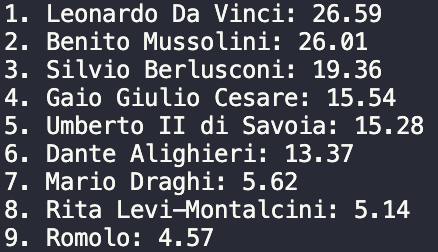

# scoring_ranking_system
Scoring and ranking system for Wikipedia pages.
This code uses the wikipediaapi library to retrieve information from Wikipedia pages of various individuals in the Italian language. The code calculates a "score" for each person based on different weighted criteria and then generates a ranked list based on these scores.
1. wiki = wikipediaapi.Wikipedia('it'): Creates a WikipediaAPI object for the Italian language.
2. people: A list of names of individuals of interest.
3. weights: A dictionary assigning relative weights to different metrics used to calculate the score for each person.
4. The following functions (num_pages, num_languages, num_bibliographies, etc.) take a person as an argument and return various metrics related to that person's Wikipedia page, such as the number of pages, the number of languages it is available in, the number of bibliographies, categories, sections, and words in the page.
5. calculate_scores(list): Takes a list of people and calculates scores using the above-defined functions. It returns a ranked list based on the scores.
6. The last part of the code calculates scores for each person in the people list, creates a ranked list, and prints the results in a readable format.

In summary, the code is designed to assess and rank individuals based on some metrics obtained from their Italian Wikipedia pages. Scores are calculated based on weights assigned to different metrics, and the final ranking is printed in descending order of scores.

<figure>
  
</figure>
